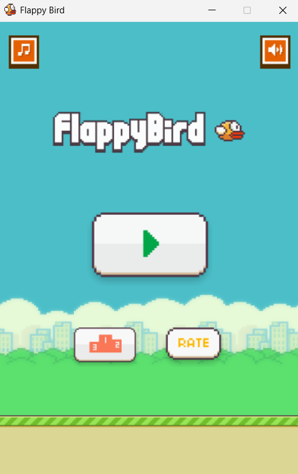
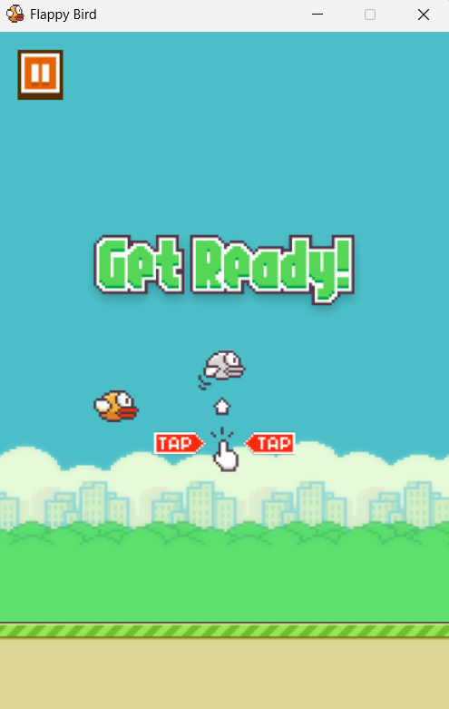
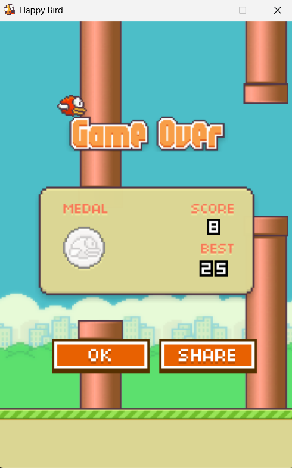
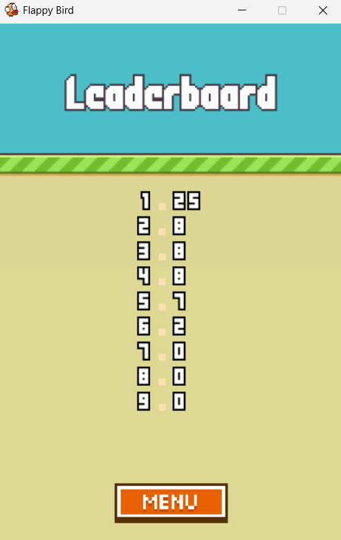

# Flappy Bird (Python / Pygame)

A polished Flappy Bird clone built with Pygame — animated sprites, auto-cycling
day/dusk/night themes, pause, medals, a top-10 leaderboard, and a one-file
desktop build. Developed incrementally: this repo's commit history is the
build log.

[](LICENSE)

<p align="center">
  
</p>

| Get Ready | Game Over | Leaderboard |
|:---:|:---:|:---:|
|  |  |  |
| Tap-to-play screen | Score card with medal + best | Top 10, sprite digits |

## Run it

```
pip install pygame
python flappy_bird.py
```

Space or click to flap.

## Build a standalone desktop app

Package the game into a single executable so players don't need Python or
Pygame installed — it runs like any normal desktop game.

```
pip install pyinstaller
pyinstaller FlappyBird.spec
```

The build lands in `dist/` (`FlappyBird.exe` on Windows, `FlappyBird` on
macOS/Linux) with all art and sound bundled inside. Equivalent one-off
command without the spec file:

```
pyinstaller --onefile --windowed --name FlappyBird --add-data "assets:assets" flappy_bird.py
```

(On Windows use `--add-data "assets;assets"` — the path separator is `;`.)

The code detects when it's running as a packaged build: assets load from the
bundle, and the leaderboard is saved to a per-user folder
(`%APPDATA%\FlappyBird` on Windows, `~/Library/Application Support/FlappyBird`
on macOS, `~/.local/share/FlappyBird` on Linux) so scores persist across runs.
Running from source is unchanged — the leaderboard stays next to the script.

> Build on the OS you're targeting: PyInstaller doesn't cross-compile, so make
> the Windows `.exe` on Windows, the macOS app on macOS, and so on.

## Journey

### v1 — Basic playable prototype
Plain shapes only: a circle for the bird, rectangles for the pipes. Gravity,
flap, collision, scrolling pipes, score, restart. No images, no menu — just
proving the core loop works before touching any art.

### v2 — Real graphics, and fixing what broke
Swapped the shapes for actual images. First pass just force-resized whatever
PNG was dropped in, which caused two problems once real assets came in:

- The source PNGs had no real alpha channel — what looked like a transparent
  checkerboard was actually baked into the pixels, so it rendered as solid
  gray/white in-game instead of disappearing. Fixed by flood-filling from the
  image edges to strip the baked-in background, leaving inner details (like
  an eye) untouched.
- Square source images were being stretched into bird/pipe shapes, distorting
  them. Fixed by cropping to actual content bounds and scaling with aspect
  ratio preserved. The pipe went further: split into a cap + a tileable body
  strip so it can extend to any length without stretching.

### v3 — Menu, leaderboard, and real button art
Added a proper front end instead of dropping straight into gameplay:

- Game states: menu → playing → game over → leaderboard
- Start and Leaderboard buttons on the menu; Retry/Menu on the game-over
  screen; Back on the leaderboard screen
- Scores persist to `leaderboard.json` next to the script, capped at the
  top 5
- Swapped the plain rectangle buttons for real art: extracted the title
  logo and the two button graphics from reference images (the button
  source image had its background scene baked in opaque, so it needed
  the same flood-fill isolation trick as the bird/pipe fix in v2)

### v4 — Full asset pack: animation, sound, scrolling ground
Replaced the hand-extracted bird/pipe art with a proper open-source asset
pack ([samuelcust/flappy-bird-assets](https://github.com/samuelcust/flappy-bird-assets),
MIT licensed):

- Bird now animates through 3 flap frames instead of a static image
- Pipe uses the pack's real sprite (same cap + tileable body approach as v2,
  now on authentic art)
- Scrolling ground strip at the bottom — bird now dies on the ground, not
  the screen edge
- Sky background fills the screen
- Score renders with the pack's pixel-digit sprites instead of system font
- Sound effects: wing flap, point scored, hit, die, menu swoosh

Title and button art from v3 were kept as-is — only the gameplay assets
were replaced.

### v5 — Front-end rebuild: home page and tap-to-play
Reworked the flow into a proper front end. States are now
start → get ready → playing → game over, with the leaderboard reachable
from the home page:

- Home page with a hovering title, the bird animating beside it, a big
  Play button, and Leaderboard + Rate buttons
- Play leads to a "Get Ready" tap-to-play screen (a banner plus a tap
  indicator with the bird beside it) before the round starts
- Reworked game-over and leaderboard screens with the new pixel button art

### v6 — Assets organised into subfolders
Split the flat `assets/` folder into `assets/sprites/` (every PNG) and
`assets/sounds/` (every WAV); the image and sound loaders were pointed at
the new locations.

### v7 — Pause, themes, transitions, audio, and a score card
The big polish pass:

- **Pause/resume** from the tap-to-play screen and mid-game, dimming the
  scene behind a dark overlay
- **Leaderboard** expanded to the top 10, drawn on a tall base with sprite
  digits and its own title art, entering with the base growing while the
  records drop in from the sky
- **Auto-cycling themes** — day / dusk / night swap every few points,
  adding a red bird and red pipes alongside the existing yellow/blue
- **Screen transitions** — dark fades between screens and slide-in
  animations for the home-page buttons and the game-over card
- **Audio toggles** — a looping theme track plus music and SFX on/off
  buttons on the home page
- **Game-over score card** — this run's score, the best score, a medal for
  a top-4 finish, and a "NEW" badge when you set a record. The leaderboard
  now keeps the top 10 (was 5 in v3)

## Credits
Gameplay sprites and sounds (v4+): [samuelcust/flappy-bird-assets](https://github.com/samuelcust/flappy-bird-assets) (MIT).
Later UI art (buttons, medals, score card) and the theme music were added
during development — check their individual licences before redistributing.

## Licence

The source code is MIT licensed — see [LICENSE](LICENSE).

The `assets/` folder is **not** covered by that licence. It contains
third-party sprites and sounds under their own terms, including the original
Flappy Bird theme music. See [NOTICE](NOTICE) before redistributing or
publishing a build.
